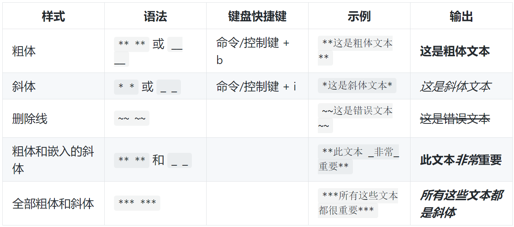
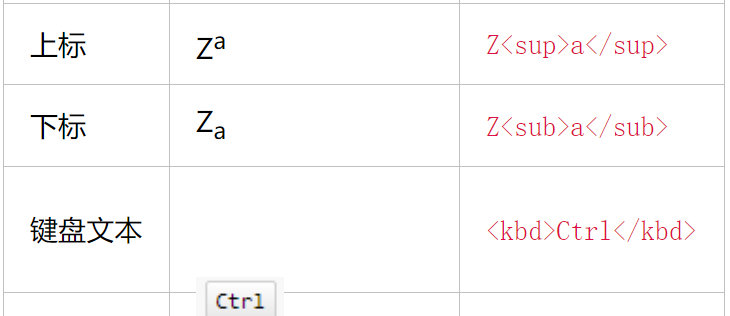

# 标准格式的撰写

## 标题

```
# 最大标题
## 第二大标题
### 第三大标题
```

## 样式文本



### 文本的引用

* 使用>符号来表示文本的引用

> 'print('hello world')'

## 引用代码

就是使用```来表示代码

## 链接

使用[]符号来表示链接的内容，将链接的URL写在()中，格式如下：
这是格式参考的网站：[GitHub Pages](https://help.github.com/cn/github/writing-on-github/basic-writing-and-formatting-syntax#content-attachments)

## 列表

通过在一行或者多行文本前面添加-或者*符号来创建无需列表
现在建议使用星号不用使用破折号了，否则会出现不合理的条

- one
- two
- three

* one

* two

* three
这是无序列表
还有一些有序列表

1. one
2. two
3. three

## 嵌套列表

在使用有序列表之后使用Tab进行缩进，之后就能实现列表的嵌套每层嵌套都会有不同的符号来表示

1. First list item
    * First nested list item
        * Second nested list item

## 任务列表

格式为：-/* 加 [ /x] 就能表示一个任务列表,在vs中建议使用*而不是-，其他地方不知道，注意我们在显示的git文件中就能实现修改文件中是空格还是x，所以是长期有效的一个修正。

```markdown
- [x] First
- [ ] Second
- [ ] Third
```

* [x] First
* [ ] Second
* [ ] Third

## 分隔符
```markdown
使用---就能实现添加一个分隔符，同样使用这种格式也能实现添加一个标题例如
一级标题
======
二级标题
-----
```

-----

一级标题
=====

二级标题
---
二级标题

## 多行代码

>hello world
hello world

>hello world
>>hello world
>>>hello world
上面的格式就能实现语句的多层嵌套

## 将多行语句变成一行

```markdown
point`
print("hello world")
str1 = 'hello world'
'point
注意使用的是`不是引号
另外合并的行还会变成引用状态
```

point `
print("hello world")
str1 = 'hello world'
` point

## 表情的插入

需要查考这里的代码地址 [表情的插入](https://www.cnblogs.com/shawWey/p/8931697.html)

## 表格的绘制

```markdown
|  a   |    b   |   c   |
|:----:|:-------|------:|
| 居中 |   左对齐|右对齐 |
|===== |========|=======|
或者使用简约的写法
a|b|c|
:-:|:-|-:
居中 |左对齐|右对齐
======= |========|=======|
能够实现一样的效果，只要中间不断开就能实现在同一表格中，表格的长度是根据最长的那一个元素来决定的。
```

|  a   |    b   |   c   |
|:----:|:-------|------:|
| 居中 |   左对齐|右对齐 |
|===== |========|=======|

a|b|c|
:-:|:-|-:
居中 |左对齐|右对齐
======= |========|=======|

### 特殊的表格

我们发现使用上面的格式只能绘制一些简单的表格如果我们想要绘制一些复杂的表格的话就要使用HTML标签
但是目前不知道怎么使用这些HTML标签
绘制HTML标签的网站：[Tables Generator ](http://www.tablesgenerator.com/) 这个网站就是能够实现将我们的表格转化成现成的HTML格式的代码

## 支持内嵌CSS样式的语句

```markdown
不会使用CSS
<p style="color: #AD5D0F;font-size: 30px; font-family: '宋体';">内联样式</p>
```

<p style="color: #AD5D0F;font-size: 30px; font-family: '宋体';">内联样式</p>

## 一些语义标签

```markdown
**斜体**
<i>斜体</i>
**加粗**
<b>加粗</b>

```

<i>斜体</i>
<b>加粗</b>


## 一些公式的书写 {#1}

```markdown
$$ x \href{why-equal.html}{=} y^2 + 1 $$
$ x = {-b \pm \sqrt{b^2-4ac} \over 2a}. $
```

$$ x = y^2 + 1 $$
$ x = {-b \pm \sqrt{b^2-4ac} \over 2a}. $

## 分隔符

使用三个或者三个以上的-或者**以及* * 

## 脚注

```markdown
Markdown[^1]
[^1]: Markdown是一种纯文本标记语言
[1]中的内容会被插入到整个文件的最后
```

Markdown[^1]
[^1]: Markdown是一种纯文本标记语言

## 锚点

```markdown
[公式标题锚点](#1)
就是可以实现将这个连接到我们前面使用的一个标题中，我们只要在标题的后面加上一个角括号和井号1就能实现这个链接到之前的标题上
```

[公式标题锚点](#1)

## 时序图和流程图的绘制

可以具体见这个链接：[在最后有流程图和时序图的绘制方法](https://www.cnblogs.com/shawWey/p/8931697.html)


## 更多的markdown格式在GitHub中的使用请见之前的文件链接